# ADXL362 采样率偏低问题分析报告

**供货商技术复核版 · V1.0 · 2026-09-21**

项目：RFID_CC1101_433MHz_V3.8 牛行为采集项圈。对象：本次现场测试的一块板卡及其 ADXL362。报告编号：ADXL362-ODR-20260921。

## 1. 执行摘要

**核心判断：现有证据强烈支持“被测 ADXL362 的内部时基路径偏慢”这一定位方向。** 在寄存器选择 25 Hz 时，独立逻辑分析仪测得 DATA_READY 约 19.75 Hz；改用经过测量的外部参考时钟后，输出速率符合该时钟对应的理论分频关系。切回内部时钟后，偏慢现象再次出现。

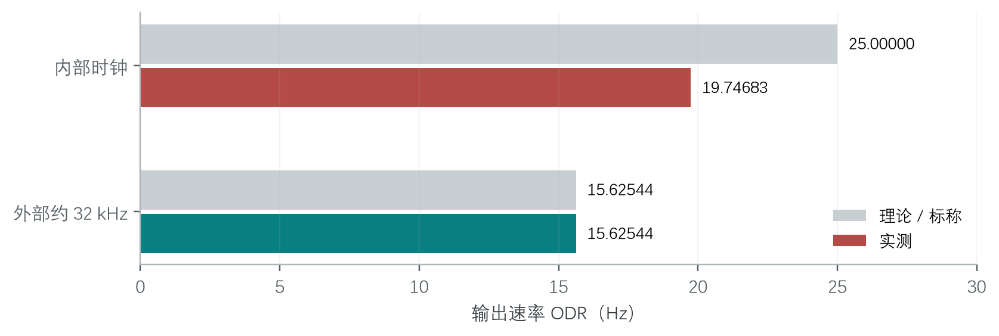

**图1：同一被测器件的时钟来源对照。** 内部时钟结果来自 F 的完整内部阶段；外部结果取 F 的第二个完整外部阶段。32 kHz 外部参考下，25 Hz 档位对应的预期输出为约 15.625 Hz，而不是 25 Hz。图中外部实测值与理论值几乎重合。

| 关键证据 | 结果 | 含义 |
| --- | --- | --- |
| 独立 DATA_READY 实验 D3 | 19.750382 Hz，988 个完整脉冲 | 偏慢发生在算法处理之前 |
| 25 / 50 / 100 Hz 分档实验 E | 实测约为标称的 79.0%～79.3% | 支持共同时间基准比例偏差 |
| 内外时钟对照 F | 内部 19.746835 Hz；外部约 15.62544 Hz | 外部时钟能消除对分频预期的偏离 |
| 50 MHz 高速复核 G | 63.99814 ms 间隔内有 2048 个参考周期 | 与外部参考 / 2048 的关系一致 |

按每 25 组三轴样本输出一次分类计算，19.750382 Hz 对应约 **2844 次分类/小时**，与用户报告的部分项圈每小时合计约 2800～3000 次相符。这是稳态推算，不是本轮一小时端到端实测。

**请求供货商协助：** 核查该样品及同批次器件的内部时钟精度、校准/修调、温压影响和批次一致性；提供原厂认可的测试方法及判定限。报告不把“强烈支持”解释为已完成芯片失效分析，也不据此判定假货。

<!-- pagebreak -->

## 2. 被测硬件与测试条件

板卡采用 STM32L051C8T6；设计料号为 ADXL362BCCZ-RL，器件位号 U2。供电为电池经 LP5907-3.0 LDO 得到 VCC_3V。原理图及网表中，ADXL362 的 VS 与 VDD/IO 均接该电源。传感器常供电，MCU 通过 SPI2 访问，INT2 接 PB1，INT1 接 PB0/TP18。

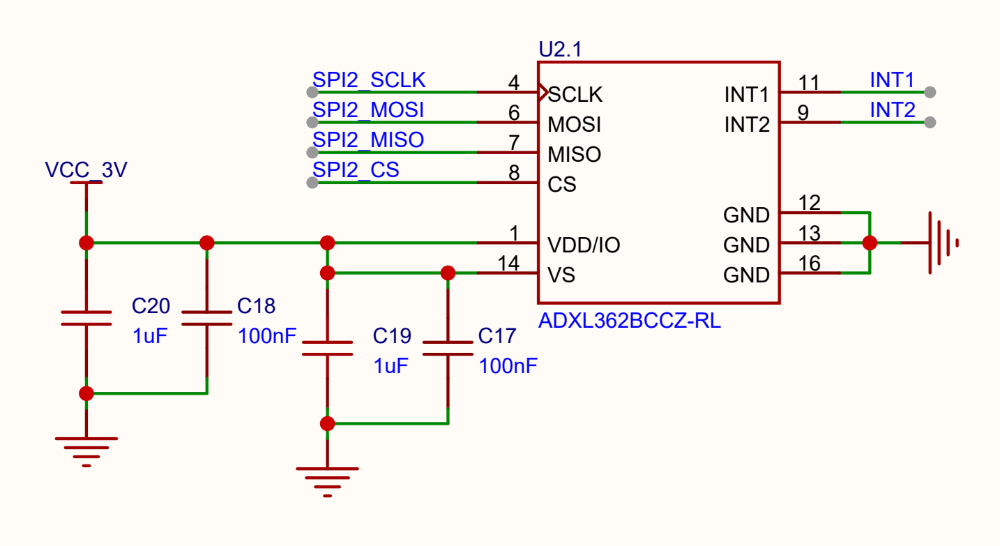

**图2：V3.8 资料包原理图第 2 页的传感器局部，直接由原文件渲染。** 未改动网络或器件值；该资料包部分图纸标题栏仍保留旧版本号，不能把标题栏旧标记当作另一块实测板。完整原理图文件名见附录。

| 项目 | 本轮条件 |
| --- | --- |
| 样品数量 | 1 块现场板卡；暂无正常项圈作同场对照 |
| 读出的器件标识 | DEVID_AD=AD，DEVID_MST=1D，PARTID=F2；诊断 REVID=03 |
| SPI | Mode 0、MSB first、CS 低有效，配置 4 MHz |
| 分析仪 / 软件 | DSLogic U3Pro16 / DSView 1.3.2 |
| 长时 / 高速记录 | 1 MHz / 约 50 s；50 MHz / 约 100 ms 或 500 ms |
| 数字判定条件 | 1.5 V 阈值、内部采样时钟、无滤波；所用归档无 RLE |
| 通道 | D0=CS，D1=SCK，D2=MOSI，D3=MISO，D4=INT2，D5=INT1（后加） |

用户用万用表在 C19 的 VCC_3V 端测得 **3.003 V**，SPI 活动时未看到读数变化；断电后的用户观察为约 0.06 V 缓慢降到 0.05 V。上述是用户读数，并非示波器电源纹波/上电波形。环境温度、仪表型号/校准证书、器件顶面批次标记及采购批号尚未纳入证据。

数字分析仪的量化步长分别为 1 μs 和 20 ns；本文保留小数便于复算，**不意味着仪器已具备对应小数位的绝对频率准确度**。

<!-- pagebreak -->

## 3. 排查顺序与证据有效性

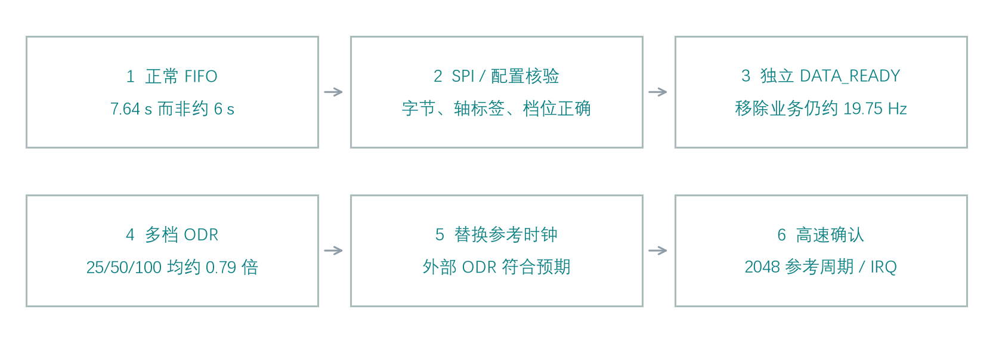

**图3：排查逻辑。** 每一步都保留上一层现象，同时减少能造成“少计数”的因素；最后用外部参考替换内部时基作对照。时间均为 2026-09-21、UTC+8。

| 证据 | 记录时间 | 目的 | 状态 |
| --- | --- | --- | --- |
| A | 15:23:26 | 正常业务下的 FIFO 水位节奏 | 有效；长时记录不解码 SPI |
| B | 15:38:28 | SPI 读数、FIFO 字节与轴标签 | 有效；50 MHz |
| C | 15:56:25 | 复位后配置写入及读回 | 有效；50 MHz |
| D3 | 16:37:35 | 禁用业务后的 DATA_READY 节奏 | 有效；独立测量 988 个脉冲 |
| E | 16:53:26 | 25 / 50 / 100 Hz 比例关系 | 有效；各阶段使用相同稳态截取规则 |
| F | 21:55:05 | 内部 / 外部时钟长时对照 | 有效；首版诊断程序 |
| G | 22:14:26 | 外部参考脉宽、周期、分频关系 | 有效；第二版诊断程序 |

### 未用来支持主要结论的记录

- 早期 15:05:10 波形的 D4 全为低。用户确认接错或接触不良后重新接线；不以该记录证明中断丢失。
- D1（16:24:47）同样没有有效 D4。其 CS 节奏仅作旁证，不能代替 DATA_READY 的直接测量。
- D2 串口记录出现两次重新启动，未作为连续时基测量；复位原因未确认。
- 启动抓波早期曾有 ST-Link 连接失败和手动复位协调失败，均不作为成功启动记录；配置结论只依据 C。
- F 所用首版诊断后来在阶段启动时超时。已完成且有波形/日志对应的阶段保留；后续修正和限制在第 11 节完整披露。

**证据分级：** 波形及字节解码属于直接观测；公式推算属于分析结果；“内部时基路径偏慢”属于由对照实验支持的工程推断。不同板卡是否具有相同原因，不能由这一个样品推及全部批次。

<!-- pagebreak -->

## 4. 正常采集的 FIFO 节奏约为 7.64 s

原设计以 25 组三轴样本形成一秒行为结果，累计六类行为，每 20 分钟上报。FIFO 采用 stream 模式，水位为 450 个 16-bit word，即约 150 组三轴样本，目标节奏约 6 s。

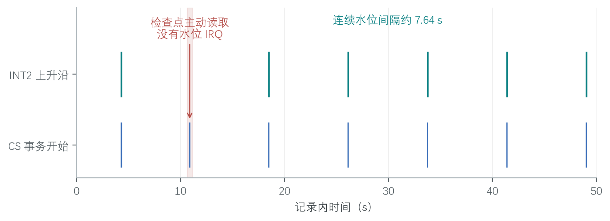

**图4：A 的真实边沿重绘。** 上排是 INT2 上升沿；下排是 CS 事务开始边沿，密集事务在该尺度上聚为一组。10.876 s 附近是检查点主动读取，不伴随 FIFO 水位中断。长时图仅用于时序，不用于解码 4 MHz SPI。

| 正常连续区间 | INT2 间隔（s） |
| --- | ---: |
| 18.469408 → 26.107624 | 7.638216 |
| 26.107624 → 33.750688 | 7.643064 |
| 33.750688 → 41.395808 | 7.645120 |
| 41.395808 → 49.038536 | 7.642728 |
| 上述四段均值 | 7.642282 |

串口在常规读取时报告 453 words，即 151 组三轴样本。按均值推算：

`151 / 7.642282 ≈ 19.76 组三轴样本/s`

453 比 450 多 3 words，反映服务读取时已有额外一组三轴数据；即使按实际 151 组计算，25 Hz 时也仅需约 6.04 s，不能解释实测约 7.64 s。

INT2 到第一笔 CS 的延迟约 2.55～2.70 ms，远小于约 1.6 s 的节奏差。早期 14.161112 s 的大间隔中包含主动部分读取，**不能按一次连续 FIFO 填充计算采样率**。该主动读取也解释了“有一组 SPI、却没有 INT2 变化”的现象。

本阶段仅凭 FIFO 字数推算速率，尚不能定位传感器内部问题；后续 B 核验传输字节，D3 直接测量 DATA_READY。

<!-- pagebreak -->

## 5. 高速 SPI 抓波支持 FIFO 传输正确

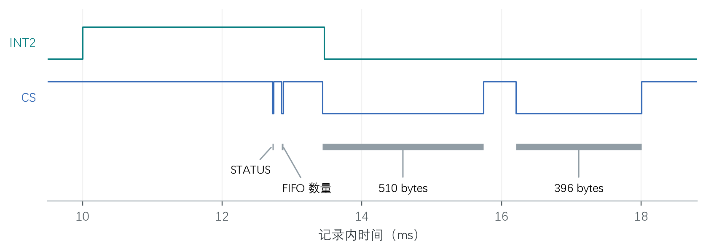

**图5：B 的 INT2、CS 及解码事务区间。** 时间来自 50 MHz 原始归档；图中标签对应软件解码结果，不是人工编造的寄存器返回值。一个 SPI 字节内的 SCK 周期主要为 240/260 ns，符合配置 4 MHz。

| 事务 | 起止时间（ms） | MOSI 头部 | MISO / 结果 |
| --- | --- | --- | --- |
| 状态 | 12.71724～12.73664 | 0B 0B 00 | STATUS=07 |
| FIFO 数量 | 12.85198～12.87588 | 0B 0C 00 00 | C5 01，即 453 words |
| FIFO 块 1 | 13.43500～15.74332 | 0D + dummy | 510 数据字节 |
| FIFO 块 2 | 16.20926～18.00454 | 0D + dummy | 396 数据字节 |

本次共 7320 个 SCK 上升沿，对应 `(3+4+511+397)×8` 位，所有事务均为完整字节。拼接后为 906 bytes / 453 words，X、Y、Z 各 151 个，无温度项；轴标签连续 X→Y→Z，跨块边界也正确，符号扩展有效。

| 时间 / 完整性指标 | 结果 |
| --- | --- |
| INT2 到第一笔 CS | 2.71720 ms |
| INT2 高电平时间 | 3.46172 ms |
| 状态、数量及两块读取的总区间 | 5.28730 ms |
| 两块之间 CS 高电平 | 465.94 μs |
| 状态标志 | 未报告 FIFO overrun 或用户寄存器错误 |

**解释：** 本记录支持该次常规读取没有少字节、轴错位或明显服务拖延。INT2 水位标志会在 FIFO 被读到阈值以下后提前撤销，并不要求保持到所有 FIFO 字节读完。

**限制：** 这不是所有 SPI 事务、900/1024 字节压力情况或模拟信号完整性的全面认证；1 MHz 长记录的 SPI 字节没有被强行解码。

<!-- pagebreak -->

## 6. 启动配置确实选择了 25 Hz

启动记录 C 经手动复位后取得，50 MHz / 500.0192 ms。全部 33 笔事务可完整解码；软复位命令为 `0A 1F 52`，复位后到下一笔寄存器事务间隔约 10.79508 ms。ID 读回为 AD / 1D / F2。

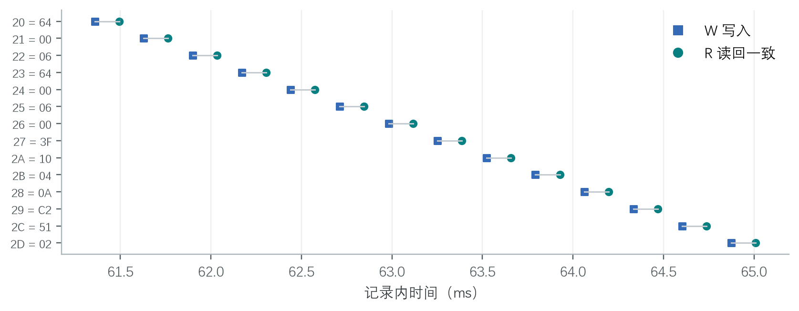

**图6：C 中 14 组配置写入/读回事务的时间与对应关系。** 横轴为记录内时间；W、R 分别为写入和紧随其后的读取。图来自已解码的真实事务。

| 地址 | 寄存器 / 字段 | 写入及读回（hex） |
| --- | --- | --- |
| 20 / 21 / 22 | Activity threshold / time | 64 / 00 / 06 |
| 23 / 24 / 25 / 26 | Inactivity threshold / time | 64 / 00 / 06 / 00 |
| 27 | ACT_INACT_CTL | 3F |
| 2A / 2B | INTMAP1 / INTMAP2 | 10 / 04 |
| 28 / 29 | FIFO_CTL / FIFO_SAMPLES | 0A / C2 |
| 2C | FILTER_CTL | **51** |
| 2D | POWER_CTL | **02** |

`FILTER_CTL=0x51` 选择 ±4 g、25 Hz 档位、HALF_BW=1；不是 12.5 Hz 或 50 Hz 档位。`POWER_CTL=0x02` 为正常 measurement 模式，未启用外部时钟、wake-up 或 autosleep。HALF_BW 改变带宽比例，不把所选 25 Hz 输出速率减半。寄存器解释依据 ADI Rev. G 第 35～36 页 [R1]。

最后 POWER_CTL 读回事务在记录内 65.02954 ms 结束。配置表与固件逐项比较过，而非只凭源代码推定芯片收到了配置。该短记录内尚未达到常规 FIFO 水位，所以没有 FIFO 读取是预期现象。

**结论范围：** 实测排除了这次启动把采样率档位写错或关键配置未写入的解释；仍不能单凭寄存器正确就证明实际输出速率正确。

<!-- pagebreak -->

## 7. 去掉业务逻辑后，DATA_READY 仍只有约 19.75 Hz

专用诊断固件保持 `FILTER_CTL=51 / POWER_CTL=02`，关闭 FIFO，令 `INTMAP2=01`，将 DATA_READY 映射到 INT2。每次事件通过读取 XDATA_L 清除。固件不运行分类、RF、EEPROM 写入或 STOP，测量由逻辑分析仪时钟完成，而非仅采用 MCU 轮询时间戳。

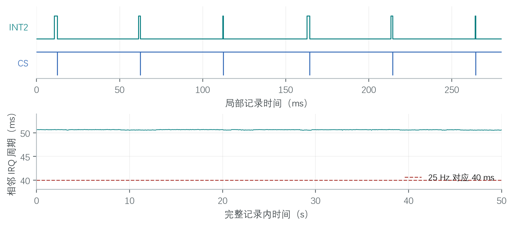

**图7：D3 的局部数字波形和完整 50 s 记录的逐间隔统计。** 上图显示每个 IRQ 后都有及时的 CS 确认；下图保留全部 987 个相邻上升沿间隔。虚线 40 ms 是标称 25 Hz 的对照，不是测量结果。

| 指标 | 实测 |
| --- | ---: |
| 完整 DATA_READY 脉冲 / CS 事务 | 988 / 988 |
| 第一 / 最后上升沿样本号 | 10692 / 49984408 |
| 最小 / 平均 / 最大周期 | 50.516 / 50.631931 / 50.717 ms |
| 987 个间隔的频率 | **19.750382 Hz** |
| IRQ 上升到 CS 下降 | 105～3371 μs |
| CS 结束到 IRQ 下降 | 18～43 μs |

全部 988 个脉冲均满足 `IRQ↑ < CS↓ < CS↑ < IRQ↓`，且每次确认明显早于下一次采样。未看到双倍周期的稳态缺口。因此，简单的漏读、主循环处理慢或业务耗时，不是重现这个偏慢现象的必要条件。

频率计算采用 `f=(N-1)×Fs/(s_last-s_first)`，不采用脉冲总数除以包含头尾残段的 50 s。这里 `N=988、Fs=1,000,000`，故 `f=987×1,000,000/(49,984,408-10,692)`。

按同一公式推算的分类总量为 `19.750382/25×3600≈2844.06 次/小时`。该对应关系解释了用户现象的数量级，但未替代真实一小时无线接收统计。

<!-- pagebreak -->

## 8. 多档 ODR 都呈相近比例偏慢

实验 E 在同一板卡依次切换 25、50、100 Hz 档位。量程、半带宽、供电、SPI、读数据方式保持不变，FIFO 关闭，仍直接测量 DATA_READY。各阶段回读 FILTER_CTL，避免根据测得频率反推档位。

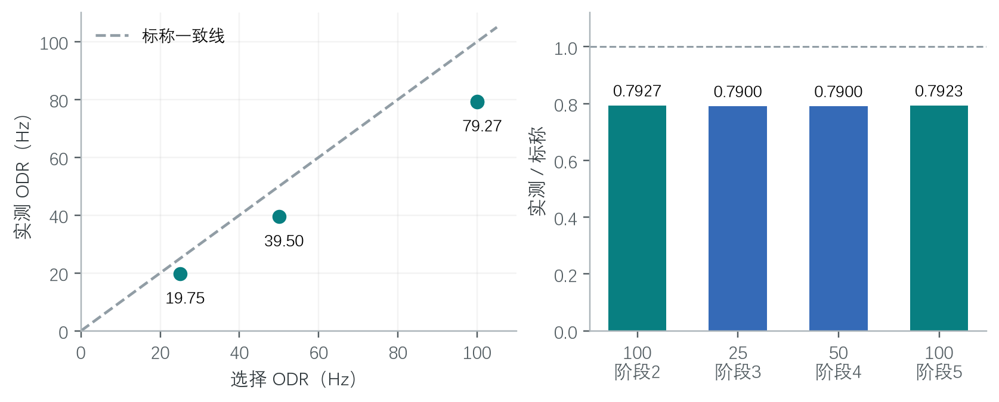

**图8：E 的实际输出速率与选择值。** 左图展示各档实测值和标称线；右图展示实测/标称比例，纵轴从 0 开始。100 Hz 的两个完整阶段分别保留，没有合并成一个人为“精确系数”。

| 阶段 | 档位 / FILTER_CTL | 稳态边沿数 | 实测 Hz | 实测 / 标称 |
| --- | --- | ---: | ---: | ---: |
| 2 | 100 Hz / 53 | 746 | 79.269014 | 0.792690 |
| 3 | 25 Hz / 51 | 186 | 19.750956 | 0.790038 |
| 4 | 50 Hz / 52 | 372 | 39.502107 | 0.790042 |
| 5 | 100 Hz / 53 | 746 | 79.233530 | 0.792335 |

### 统一的稳态截取方法

所有完整阶段统一排除开头 500 ms 和末尾 100 ms，再按首末保留边沿计算频率。切换/初始化时的短间隔保留在原始记录中，但不当作稳态 ODR；截取规则并非按结果好坏挑选。对全部 2050 个保留 IRQ，CS 确认均位于 IRQ 高电平内。

**解释：** 三档都约为标称的 79.0%～79.3%，比“单独 25 Hz 档位配错”更符合共同时间基准的比例误差。档间存在约 0.3 个百分点差异，不能把它强行压成一个完全相同的校准常数。

此时“内部时钟偏慢”仍只是较强假设；下一步必须用独立参考替换内部时钟，观察采样是否遵循预期关系。

<!-- pagebreak -->

## 9. 外部参考实验的原理与控制变量

ADI 数据手册说明输出速率随时钟成比例变化，典型内部参考为 51.2 kHz；允许通过 INT1 输入外部参考。对 25 Hz 档位，关系可写为 [R1，第 19、44 页]：

`ODR_actual = ODR_selected × f_reference / 51200`

`ODR_actual(25 Hz 档位) = f_reference / 2048`

因此本轮选用 **32 kHz**，预期输出 **15.625 Hz、周期 64 ms**。这是有意选择的受控对照，不是试图用 32 kHz 达到 25 Hz。

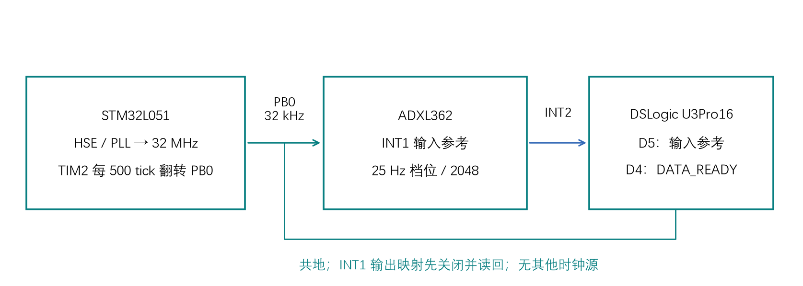

**图9：测试连接示意，依据原理图、网表和诊断固件绘制。** PB0 已连接 ADXL362 INT1，不改 PCB。D5 直接测量实际送入传感器的参考时钟，D4 测量输出 DATA_READY。

| 项目 | 内部阶段 | 外部阶段 |
| --- | --- | --- |
| FILTER_CTL / FIFO_CTL / INTMAP2 | 51 / 00 / 01 | 相同 |
| INTMAP1 | 00 | 00，必须读回确认 |
| POWER_CTL | 02 | 42（EXT_CLK=1） |
| MCU PB0 | 高阻 | 约 32 kHz 输出 |
| 业务负担 / STOP / EEPROM 写入 | 均禁用 | 相同 |

PB0 无可用定时器输出复用功能，因此测试使用 32 MHz 定时器、每 500 个 tick 中断翻转 PB0，形成约 32 kHz。该方案有中断延迟检查，且必须通过 D5 波形复核；它不是生产低功耗方案。相关 MCU 管脚/总线资料见 [R2][R3]。

顺序为：PB0 高阻→传感器初始化→standby→禁用 INT1 输出并读回→启动参考→选择 EXT_CLK→稳定 600 ms→清理初始 DATA_READY→测量 10 s。退出先令传感器 standby，再停止参考并释放 PB0。无第二个信号源接入，避免电气争用。

<!-- pagebreak -->

## 10. 长时 A/B 结果：外部符合分频关系，内部仍偏慢

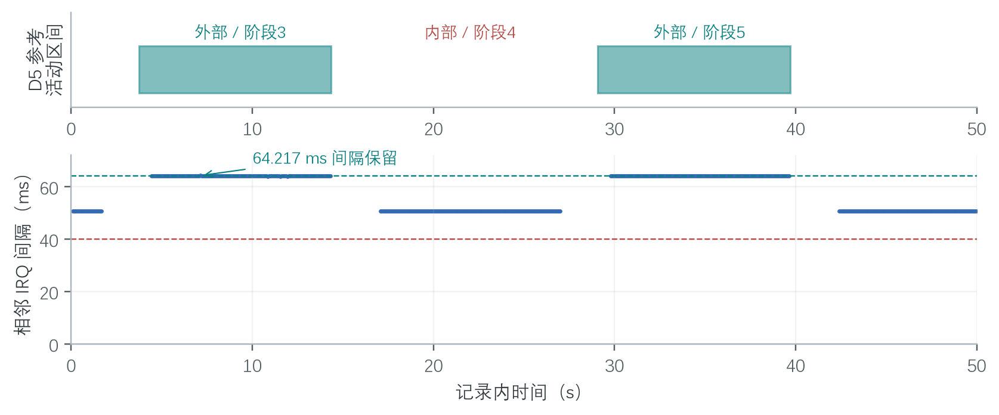

**图10：F 原始记录的参考时钟活动区间和相邻 DATA_READY 周期。** D5 的密集脉冲在上图显示为带状；下图仅绘出 0.5 s 以下的相邻间隔以避免 standby 间隔拉高纵轴，原始边界仍保留在数据中。主结论只使用下面三个完整阶段。

| 阶段 | 来源 | 原始 / 稳态边沿数 | 稳态 ODR（Hz） | 由实测 D5 推算（Hz） |
| --- | --- | ---: | ---: | ---: |
| 3 | 外部 | 156 / 146 | 15.625229 | 15.625439 |
| 4 | 内部 | 198 / 186 | 19.746835 | 标称应为 25 |
| 5 | 外部 | 156 / 146 | 15.625439 | 15.625440 |

两段参考时钟各含 339762 个上升沿，频率分别为 32000.898916、32000.901930 Hz；在 1 μs 分辨率下，完整周期为 31/32 μs，高、低电平宽度均为 15/16 μs，未见缺周期。阶段 3、4、5 与同步 UART 的配置标记相匹配：FILTER_CTL=51，POWER_CTL 分别为 42、02、42。

所有阶段仍使用相同 500 ms / 100 ms 稳态截取规则。三个完整阶段共 478 个保留 IRQ，每个高电平内都有且只有一次完整 CS 确认。首尾不完整阶段及初始化单脉冲没有混入主对照表。

### 不隐藏异常间隔

阶段 3 有一个 **64.217 ms** 间隔，对应约 2055 个参考周期；该处 D5 仍连续，原因尚未确定，已保留在图和统计中。其余多数间隔对应 2048 周期；1 MHz 量化使边界计数可能呈 2047/2049。阶段 5 稳态周期为 63.998～63.999 ms。不能把本结果描述为“每个周期绝对完美”。

**对照结论：** 外部阶段的输出符合实测参考所预测的速率；在同板、同固件、同 SPI 条件下切回内部参考，约 21% 的偏慢重新出现。问题重点因而收敛到传感器内部时基路径及其影响因素。

<!-- pagebreak -->

## 11. 高速参考复核与诊断程序异常披露

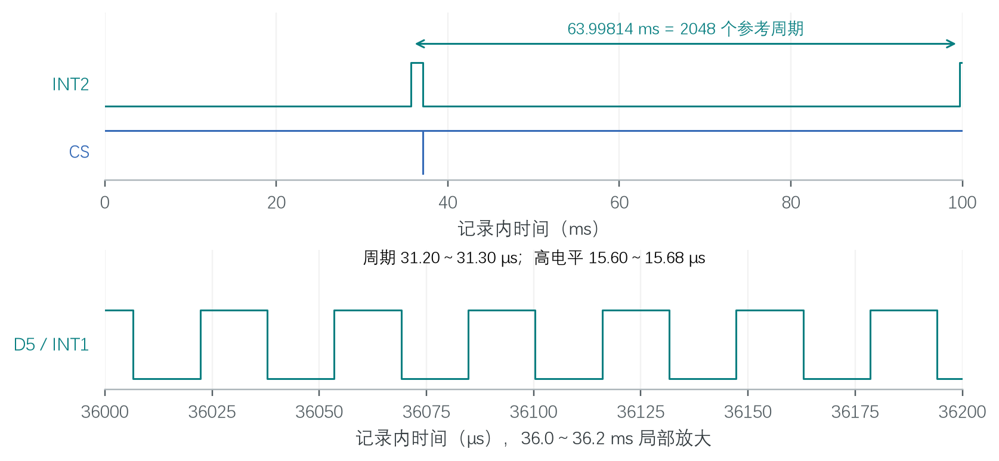

**图11：G 的真实数字波形重绘。** 上部显示 100 ms 内的 DATA_READY 和 CS；下部放大其中一段 D5 参考周期。第二个 IRQ 位于记录末尾，其后 SPI 确认超出文件范围，未声称已捕获。

| 项目 | G 实测 |
| --- | --- |
| D5 上升沿 / 完整周期数 | 3200 / 3199 |
| 参考频率 / 周期范围 | 32000.925116 Hz / 31.20～31.30 μs |
| 高 / 低电平宽度范围 | 15.60～15.68 / 15.58～15.66 μs |
| 两个 D4 上升沿间隔 | **63.99814 ms** |
| 两个上升沿之间的 D5 周期数 | **2048** |
| 由该次参考频率预测的间隔 | 63.998149822 ms |

本次完整 SPI 确认的 MOSI 为 `0B 0E 00`，MISO 为 `00 00 0F`，即读取 XDATA_L；CS 区间 37.06626～37.09106 ms，INT2 在 37.11596 ms 降低。SCK 完整周期为 12/13 个采样点，符合配置 4 MHz。这一短记录验证参考的数字周期、占空比及分频关系，不等价于模拟边沿或长时抖动认证。

### 首版诊断的启动超时与修正

F 所用 V1 完成阶段 0～9 后，在阶段 10 出现 n=0/status=2；复位重试在阶段 0 出现同类超时。代码检查发现：初始清除读取期间若新 DATA_READY 到来，软件可能尚未“armed”就看到保持高电平，从而等待超时。V2 在计数前最多三次清除并确认低电平，增加故障寄存器记录；新增主机竞态测试在 V1 失败、V2 通过。

**未取得当时故障波形，不能证明两次现场超时一定由该竞态引起。** V2 在板上于 22:14:59 输出 COMPLETE，表明 24 阶段循环未走错误退出；UART 分段记录有缺口，不能声称保留了全部阶段日志。G 使用 V2，恰落在日志缺口，不给它强行标注确切阶段号。所有正常生产镜像未受此测试修正影响。

<!-- pagebreak -->

## 12. 原因判断、结论边界与供货商请求

| 候选解释 | 本轮证据 | 判断与剩余边界 |
| --- | --- | --- |
| 应用算法 / 存储 / RF 太慢 | D3 删除这些路径后仍 19.75 Hz | 不是复现本板慢速采样的必要条件 |
| STOP 或 MCU 时间戳不准 | D3 禁止 STOP，独立分析仪直接测 IRQ | 不足以解释独立测得的偏慢 |
| SPI 丢字节 / FIFO 轴错位 | B 完整 906 bytes、连续轴标签；D3 不用 FIFO | 对已捕获场景不支持该解释 |
| ODR 或工作模式写错 | C 总线读回；E/F 阶段配置回读 | 不支持本次测试配置错误 |
| 内部时基路径偏慢 | E 各档比例相近；F/G 外部参考符合预期 | **当前证据最强的定位方向** |
| 供电、温度、器件批次/修调影响 | 仅有 DC 读数；无温度扫描/正常板替换 | 仍需原厂确认，不能完全排除 |

由内部实测 19.746835 Hz 反推的等效时基约为 `19.746835×2048≈40.44 kHz`，低于典型 51.2 kHz。**这是基于分频关系的等效推断，不是直接测到了芯片内部振荡器节点。** 外部结果支持下游采样/输出通路能按预期时钟运行，但不能仅凭外部接管区分内部振荡器本体、修调状态、选择路径或环境影响。

数据手册第 19 页描述的约 3% 为样本群体时钟分布的典型标准差，**不是保证的 ±3% 上下限**。本文不把约 21% 偏差擅自转成合同“不合格”判定，也不据此给出统计置信度或器件真伪结论。请供货商/ADI 明确保证限及适用条件。

### 请供货商提供的技术复核

1. 确认本料号及对应批次在本供电、温度与配置下的内部 ODR/时钟判定标准；解释约 0.79 比例是否可接受及依据。
2. 复测退回样品和同批次样品，记录顶面标识、批号、温度、VS/VDDIO、配置值、内部/外部参考结果及测量设备。
3. 在相同板卡上换用来源明确的已知正常 ADXL362，或将原样品放入原厂参考板作交叉对照，以分离板级和器件因素。
4. 检查内部时钟校准/修调和已知勘误；如需读取非公开寄存器，请由原厂给出正式安全流程，不自行尝试写入。
5. 给出失效分析或批次筛选建议，并说明需要补充的电源纹波、上电斜率、温度测试及样品数量。

**样品处置：** 在取得供货商取证要求前，建议保留被测器件和原始归档，不先重焊、更换或尝试未知修调。未进行计数补偿、重采样、阈值修改或无线协议变更；原正常固件已恢复。

<!-- pagebreak -->

## 13. 原始证据索引与 SHA-256

以下均为实际归档文件；字母是本报告引用代号。哈希用于核对文件一致性，不是第三方时间戳或公证。报告图是由这些文件重绘的证据可视化，**不是 DSView 原生截图**；原始 `.dsl` 才是复核基础。原始文件未嵌入 PDF，需另行提供时可按下表核验。

### A · 正常 FIFO 节奏 · 1 MHz / 50 s

文件：DSLogic U3Pro16-la-260921-152326.dsl  
SHA-256：`74DD03753694FD1B7238F5C1B7CC0012988146958D13A14C85A4861E0F15253A`

### B · FIFO SPI · 50 MHz / 100 ms

文件：DSLogic U3Pro16-la-260921-153828.dsl  
SHA-256：`616603F5C0E21C350A7571041C0A48655C9B0BF1AC295A121E2708DE1D461A44`

### C · 启动配置 · 50 MHz / 500 ms

文件：DSLogic U3Pro16-la-260921-155625.dsl  
SHA-256：`E6969BA8AF2D52CCC37D53B351E049F880D862E7AC6E59B7D8E2D586D466843B`

### D3 · 独立 DATA_READY · 1 MHz / 50 s

文件：DSLogic U3Pro16-la-260921-163735.dsl  
SHA-256：`00676EF8ADC037EA569122703581E7238B3F898D588D759DFC202FA13F2F6D30`

### E · 多档 ODR · 1 MHz / 50 s

文件：DSLogic U3Pro16-la-260921-165326.dsl  
SHA-256：`B13F1FF0D4E1D0CC344A821D38B0F2773C5681E3A42328E22BCD96DD30D9F4AB`

### F · 内外时钟 A/B · 1 MHz / 50 s

文件：DSLogic U3Pro16-la-260921-215505.dsl  
SHA-256：`E858D5503F13A74213C20709B6AD224AC1EEC50072D6499561749862634FDAC4`

### G · 外部参考高速复核 · 50 MHz / 100 ms

文件：DSLogic U3Pro16-la-260921-221426.dsl  
SHA-256：`799ED3E3CF3E533D4D07350AD2915690A82740ADADD4DBE0D9980A0689B2A031`

Markdown 源稿目录另含 `source_manifest.json`，记录原始文件大小、采样参数及图表来源；不包含设备号、探针序列号、EEPROM 原始内容或采购合同。若作为正式售后资料发送，应另补采购批号、样品标识及器件顶面照片。

<!-- pagebreak -->

## 14. 可复核方法、固件与来源

### 数据处理方法

DSL 按 ZIP 读取 header、session 和各通道 `L-n/block`，按数字块序拼接，以 LSB-first 展开归档位；SPI 字节另按 MSB-first 解码。原始触发位置、完整事务长度和已知命令用于交叉检查。频率统一按首末上升沿间隔计算。1 MHz 记录只分析事件时序，50 MHz 记录才用于解码 4 MHz SPI。

长记录 E/F 的完整阶段统一去掉头部 500 ms、尾部 100 ms；不把 standby 间隔计入频率。100 ms 的 G 不满足该稳态截取长度，故仅报告原始两个 IRQ 和参考周期，不能冒称长时稳态统计。绘图对选定时间范围保留全部数字跳变，未做插值平滑；具体窗口及任何显示过滤均在图注说明。

复算工具位于诊断提交 `3c02631`：`Tools/analyze_adxl362_dsl.py`、`Tools/analyze_adxl362_timing.py`、`Tools/analyze_adxl362_extclock.py`。输入示例：

```text
python Tools/analyze_adxl362_dsl.py <B_or_C_or_G.dsl>
python Tools/analyze_adxl362_timing.py <E.dsl> --segments
python Tools/analyze_adxl362_extclock.py <F_or_G.dsl>
```

### 关键镜像与恢复

V1 外部时钟诊断 HEX SHA-256：  
`FFDCA08929F6656F28D7A32DE1754F3FB0EB1FFDF01BA1243CE4179AECEA5F00`

V2 外部时钟诊断 HEX SHA-256：  
`5D45BF022CC91CBEFC3D6467F218921587E5748617C82BB3B445EB001DC97F61`

恢复的原正常 HEX SHA-256：  
`6A823BA02515CF614E70F79850F2E62D5BDE56AD750DAEA67C706877982D6866`

诊断及恢复过程中逐次比较完整 EEPROM 和选项字节，结果一致；未整片擦除、未改身份数据或选项。恢复后观察到正常 FIFO 读取及检查点，传感器/无线/存储错误计数为 0/0/0。三套正常构建 BIN 与诊断改动前一致，7 项主机测试、28 项解析测试及 15738 个历史 CSV 分类输出回归通过。测试通过不等于采样率硬件验收通过。

### 参考资料

- **[R1]** Analog Devices，ADXL362 Data Sheet，Rev. G（2023-05）；重点第 19 页 External Clock、第 27 页 STATUS、第 35～36 页 FILTER_CTL/POWER_CTL、第 39～40 页供电、第 44 页外部时钟。[官方 PDF](https://www.analog.com/media/en/technical-documentation/data-sheets/adxl362.pdf)。
- **[R2]** ST，STM32L051 DS10184，Table 17：PB0 复用功能。[官方数据手册](https://www.st.com/resource/en/datasheet/stm32l051t6.pdf)。
- **[R3]** ST，RM0377，Rev. 10，Figure 1 / p.49：GPIO 与 CPU IOPORT 架构。[官方参考手册](https://www.st.com/resource/en/reference_manual/rm0377-ultralowpower-stm32l0x1-advanced-armbased-32bit-mcus-stmicroelectronics.pdf)。
- **[R4]** 项目原理图：`SCH_RFID_CC1101_433MHz(2025.8.18)_2026-09-21.pdf`，V3.8 资料包；图 2 为其第 2 页局部。项目测量底稿：`Doc/Development/ADXL362_MEASUREMENTS.md`，提交 `3c02631`。

**报告范围截至 2026-09-21。** 未完成正常板对照、器件替换、温度/纹波扫描、原厂失效分析及基站长期验收。当前结果用于提出有依据的供货商技术复核请求，不代替原厂最终失效判定。
